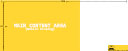
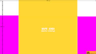
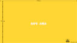

# Twitch Streamer Starter Kit
Start kit for Twitch Streamers who are putting their setup, channel, and other stuff together in order to be successful.

---
## BEGINNER LINKS
Name | Description | Link
--- | --- | ---
Twitch Creator Camp | Tutorials put together by Twitch to help streamers start out | [TwitchCreatorCamp](https://www.twitch.tv/creatorcamp/en/)
Tom's Guide To Twitch | Quick article by Tom's Guide explaining what is needed and tips to help be better | [TomsGuideToTwitch](https://www.tomsguide.com/us/twitch-streaming-guide,review-3009.html)

---
## SOFTWARE LINKS
Name | Description | Link
--- | --- | ---
Open Broadcast Software | Widely used open source software to stream to Twitch, Youtube, and other sites as well as record. | [OpenBroadCasterLink](https://obsproject.com/)
StreamLabs | Site with multiple tools to support or replace OBS and help show widgets. | [StreamLabs](https://streamlabs.com/)
Stream Elements | Site with multiple tools to support or replace OBS and help turn personalization into the cloud. | [StreamElements](https://streamelements.com/)

---
## TWITCH IMAGE SIZES
Image | Name | Dimensions | File
--- | --- | --- | ---
 | Profile Photo | 256 x 256 px | TCG_TwitchProfilePicture ( [PSD](Image_Templates/TCG_TwitchProfilePicture.psd) [PNG](Image_Templates/TCG_TwitchProfilePicture.png) )
 | Profile Banner | 1200 x 480 px | TCG_TwitchProfileBannerTemplate ( [PSD](Image_Templates/TCG_TwitchProfileBannerTemplate.psd) [PNG](Image_Templates/TCG_TwitchProfileBannerTemplate.png) )
 | Info Panels | 320 x 300 px | TCG_TwitchPanelTemplate ( [PSD](Image_Templates/TCG_TwitchPanelTemplate.psd) [PNG](Image_Templates/TCG_TwitchPanelTemplate.png) )
 | Video Player Banner | 1920 x 1080 px | TCG_TwitchVideoOfflineTemplate ( [PSD](Image_Templates/TCG_TwitchVideoOfflineTemplate.psd) [PNG](Image_Templates/TCG_TwitchVideoOfflineTemplate.png) ) 
 | Video Thumbnail | 1280 x 720 px | TCG_TwitchVideoOfflineTemplate ( [PSD](Image_Templates/TCG_TwitchVideoCoverTemplate.psd) [PNG](Image_Templates/TCG_TwitchVideoCoverTemplate.png) ) 

---
## CHANGE LOG
###### 04/16/2019 - GeekTekRob - Twitch Template Thumbnails, Beginner & Software Links, and files to support.
###### 04/15/2019 - GeekTekRob - Updated Twitch Image Sizes and added template image files
###### 04/15/2019 - GeekTekRob - Initial Build of repo

