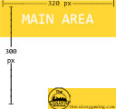

# Twitch Streamer Starter Kit
Start kit for Twitch Streamers who are putting their setup, channel, and other stuff together in order to be successful.

---
## TWITCH IMAGE SIZES
Image | Name | Dimensions | File
--- | --- | --- | ---
 | Profile Photo | 256 x 256 px | TCG_TwitchProfilePicture ( [PSD](Image_Templates/TCG_TwitchProfilePicture.psd) [PNG](Image_Templates/TCG_TwitchProfilePicture.png) )
 | Profile Banner | 1200 x 480 px | TCG_TwitchProfileBannerTemplate ( [PSD](Image_Templates/TCG_TwitchProfileBannerTemplate.psd) [PNG](Image_Templates/TCG_TwitchProfileBannerTemplate.png) )
 | Info Panels | 320 x 300 px | TCG_TwitchPanelTemplate ( [PSD](Image_Templates/TCG_TwitchPanelTemplate.psd) [PNG](Image_Templates/TCG_TwitchPanelTemplate.png) )
 | Video Player Banner | 1920 x 1080 px | 
 | Video Thumbnail | 1280 x 720 px | 

---
## CHANGE LOG
###### 04/15/2019 - GeekTekRob - Updated Twitch Image Sizes and added template image files
###### 04/15/2019 - GeekTekRob - Initial Build of repo

